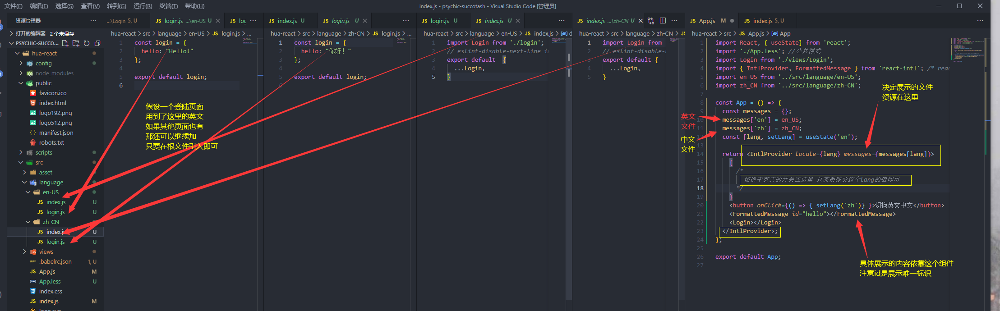
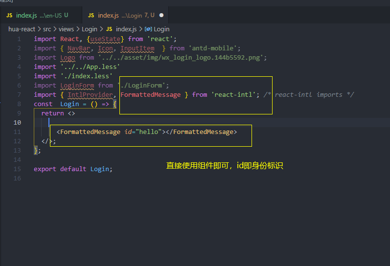

# React国际化
## 步骤1 引入相关插件 react-intl
```js
  yarn add react-intl --save
```

## 步骤2 在根组件引入插件, 然后使用组件 IntlProvider组件 提供资源

* 具体代码
```jsx
import React, { useState} from 'react';
import './App.less'; //公共样式
import Login from './views/Login';
import { IntlProvider, FormattedMessage } from 'react-intl'; /* react-intl imports */
import en_US from '../src/language/en-US';
import zh_CN from '../src/language/zh-CN';
const App = () => {
  const messages = {};
  messages['en'] = en_US;
  messages['zh'] = zh_CN;
  const [lang, setLang] = useState('en');

  return <IntlProvider locale={lang} messages={messages[lang]}>
    {
      /* 
        切换中英文的开关在这里 只需要改变这个lang的值即可
      */
    }
    <button onClick={() => { setLang('zh')} }>切换英文中文</button>
    <FormattedMessage id="hello"></FormattedMessage>
    <Login></Login>
  </IntlProvider>;
};
export default App;
```


## 步骤3 在具体的某个页面使用时不需要引入IntlProvider组件 了 ，直接使用FormattedMessage组件即可



## 步骤4 改变根组件 IntlProvider组件的locale属性 和messages属性即可实现中英文切换
